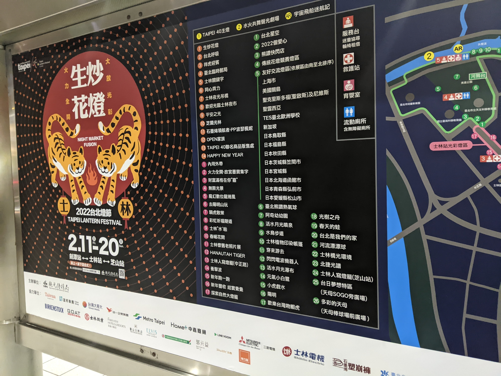
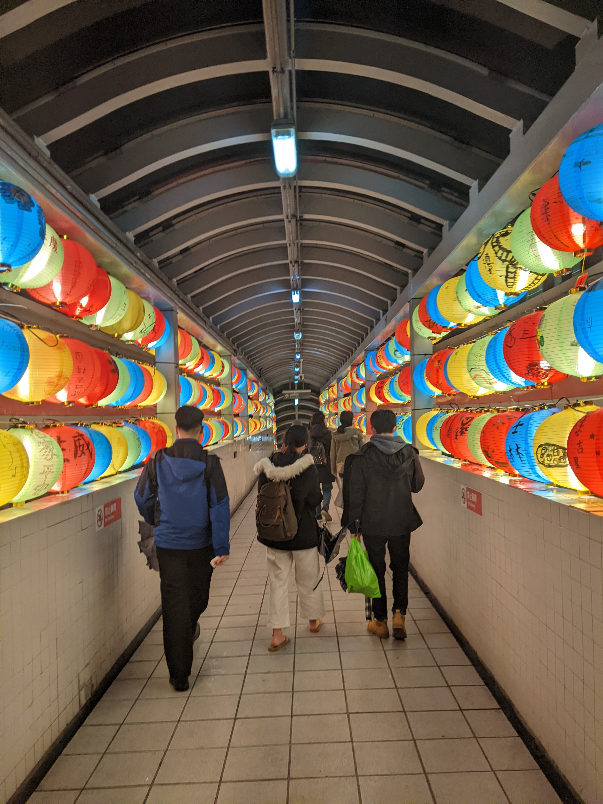

### 個人圖片集


### code

```html
<!DOCTYPE html>
<html lang="en">
  <head>
    <meta charset="UTF-8" />
    <meta http-equiv="X-UA-Compatible" content="IE=edge" />
    <meta name="viewport" content="width=device-width, initial-scale=1.0" />
    <title>個人圖片集</title>
    <link rel="stylesheet" href="imageGallary.css" />
  </head>
  <body>
    <div class="title1"><h1 class="title1">2022台北燈會</h1></div>
    <div class="line3">
      
      
      
      
      
      
      
      
      
      
    </div>
  </body>
</html>

```

```css
*{
    margin: 0;
    padding: 0;
    box-sizing: border-box;
}
.title1 .title1{
    font-size: 50px;
    font-weight: bold;
    font-family: Georgia, 'Times New Roman', Times, serif;
    color: #ffa600e5;
    padding-left: 50px;
}
.line3 img{
    width: 30%;
    margin: 1.4%;

}
```
